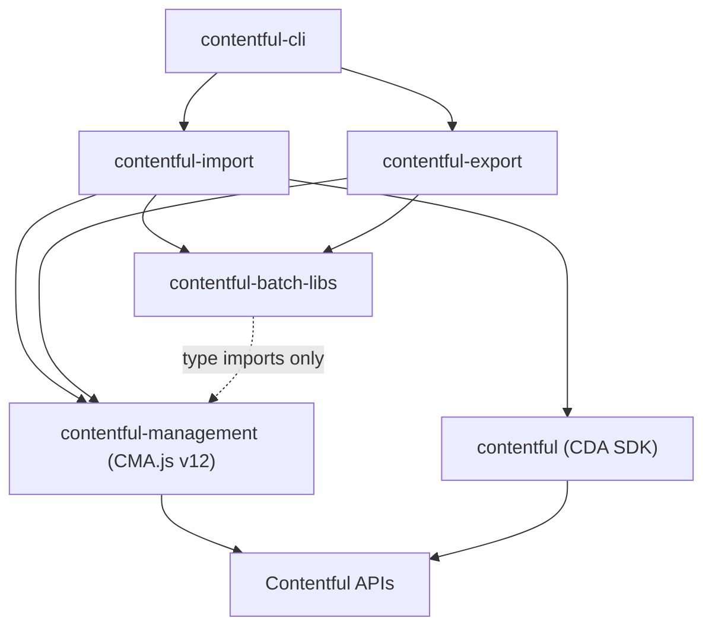

# Architecture

<!-- Generated by seed-golden-context | Last updated: 2026-05-07 -->

## Overview

`contentful-batch-libs` is a shared TypeScript library providing batch-oriented utilities for Contentful's data-move CLI tools. It encapsulates logging, proxy handling, task orchestration, entity naming, and sequence header generation so that consumers (`contentful-import`, `contentful-export`) do not duplicate cross-cutting concerns.

## System Context

**Note:** `contentful-management` and `contentful` are devDependencies used only for type imports (`SysLink`, `KeyValueMap`). The library does not instantiate CMA/CDA clients itself — consumers provide their own.

## Internal Structure

| Module | Purpose |
|---|---|
| `lib/index.ts` | Public barrel export — defines the library's API surface |
| `lib/logging.ts` | Event-emitter-based logging system (info/warning/error), log file writing, and display formatting |
| `lib/listr.ts` | `wrapTask` helper that connects the logging emitter to Listr2 task output with error formatting |
| `lib/proxy.ts` | HTTP/HTTPS proxy string parsing and `HttpsProxyAgent` construction |
| `lib/add-sequence-header.ts` | Adds a unique `CF-Sequence` UUID header to request header objects |
| `lib/get-entity-name.ts` | Extracts a human-readable name from Contentful entities (supports `name`, `fields.title`, `sys.id` fallback) |
| `lib/type-guards.ts` | TypeScript type guards for Contentful entity shapes (`isFields`, `isSysLink`, `isDetails`, etc.) |

## Data Flow

This library does not manage a data pipeline itself (the historical "get/transform/push" modules were removed). Instead, it provides **cross-cutting utilities** that consumers compose into their own pipelines:

1. **Task orchestration** — Consumer creates Listr2 tasks, wraps them with `wrapTask()` to get automatic log capture and error formatting
2. **Logging** — `logEmitter` emits info/warning/error events; `setupLogging()` collects them; `writeErrorLogFile()` persists errors to disk
3. **Proxy** — Consumer passes a proxy string; `proxyStringToObject()` parses it, `agentFromProxy()` returns an `HttpsProxyAgent`
4. **Headers** — `addSequenceHeader()` stamps each request with a unique `CF-Sequence` UUID for tracing

## Key Dependencies

| Dependency | Why it's here |
|---|---|
| `date-fns` | Formatting ISO timestamps in log output |
| `figures` | Unicode symbols (tick, warning, cross) for log display |
| `https-proxy-agent` | HTTP/HTTPS proxy support for SDK clients |
| `uuid` | Generating unique `CF-Sequence` headers |
| `listr2` (devDep) | Type imports for task wrapper signatures |
| `contentful-management` (devDep) | Type imports (`SysLink`, `KeyValueMap`) |

## Configuration

This library has no runtime configuration of its own. It consumes configuration passed by its callers (proxy strings, file paths for error logs, header objects).

## Integration Points

### Upstream (this repo consumes)

- **Contentful Management SDK types** (`contentful-management`) — for entity type definitions
- **Node.js standard library** (`node:events`, `node:fs`, `node:stream`) — for logging infrastructure

### Downstream (consumes this repo)

- **`contentful-import`** — uses logging, task wrapping, proxy, and sequence headers
- **`contentful-export`** — uses logging and shared utilities
- **`contentful-cli`** — transitively via import/export
